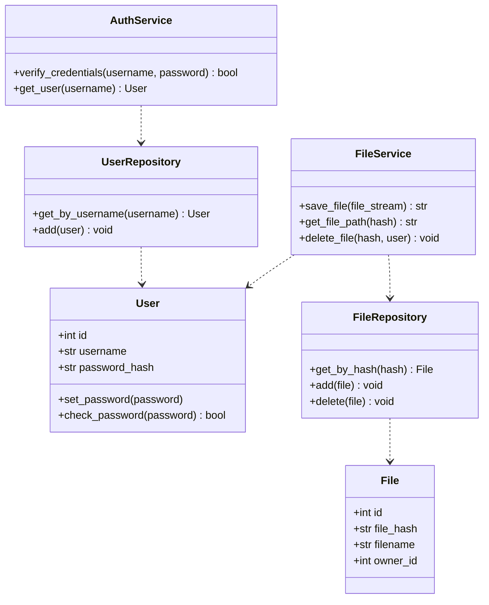

# File Storage Service

[](https://www.python.org/)
[](https://flask.palletsprojects.com/)
[](https://python-poetry.org/)

---

## Описание

File Storage Service — REST API на Flask для управления файлами с базовой HTTP-аутентификацией.

Ключевые возможности:
- Загрузка файлов с вычислением SHA256-хэша и сохранением по хэшу (дедупликация)
- Получение файлов по хэшу без авторизации
- Удаление файлов с проверкой прав владельца (требуется авторизация)
- Хранение пользователей и файлов в базе данных (SQLAlchemy + SQLite по умолчанию)
- HTTP Basic Auth для защищённых операций
- Логирование в файл с ротацией
- Регистрация не предусмотрена.

---

## Архитектура

Приложение разделено на слои, реализующие принципы чистой архитектуры и разделения ответственности:

- **Конфигурация:**  
  Файл `app/config.py` содержит настройки приложения.

- **Расширения:**  
  `app/extensions.py` — инициализация Flask-расширений (SQLAlchemy, HTTPBasicAuth).

- **Модели:**  
  `app/models` — SQLAlchemy ORM-модели (User, File).

- **Репозитории:**  
  `app/repositories` — слой доступа к данным, работающий с моделями и БД.

- **Сервисы:**  
  `app/services` — бизнес-логика (аутентификация, управление файлами).

- **Утилиты:**  
  `app/utils` — вспомогательные функции, например, вычисление хэша файла, работа с файловой системой.

- **Исключения:**  
  `app/exceptions` — кастомные ошибки для контролируемой обработки ошибок.

- **Роуты:**  
  `app/routes` — Flask Blueprint с HTTP эндпоинтами для взаимодействия с API.

- **Главный файл:**  
  `app/__init__.py` — создание и конфигурация Flask приложения.

Такое разделение облегчает тестирование, поддержку и расширение функционала. Но на тесты, как обычно, времени нет.

---

## Установка

```commandline
git clone https://github.com/YaroslavSmrinov/file-storage.git
cd file-storage
poetry install
```

---

## Запуск

```commandline
export FLASK_APP=app
export FLASK_ENV=development
poetry run flask run --port 5000

```
---
## API
| Метод  | URL                  | Описание                     | Авторизация |
| ------ | -------------------- | ---------------------------- | ----------- |
| POST   | `/files/upload`      | Загрузить файл               | Basic Auth  |
| GET    | `/files/<file_hash>` | Скачать файл по SHA256-хэшу  | Нет         |
| DELETE | `/files/<file_hash>` | Удалить файл владельцем      | Basic Auth  |
| GET    | `/auth/verify`       | Проверка корректности логина | Basic Auth  |

---
## Инициализация дефолтных пользователей

При старте создаются три пользователя:

| Логин | Пароль    |
| ----- | --------- |
| user1 | password1 |
| user2 | password2 |
| user3 | password3 |

---
## ULM

